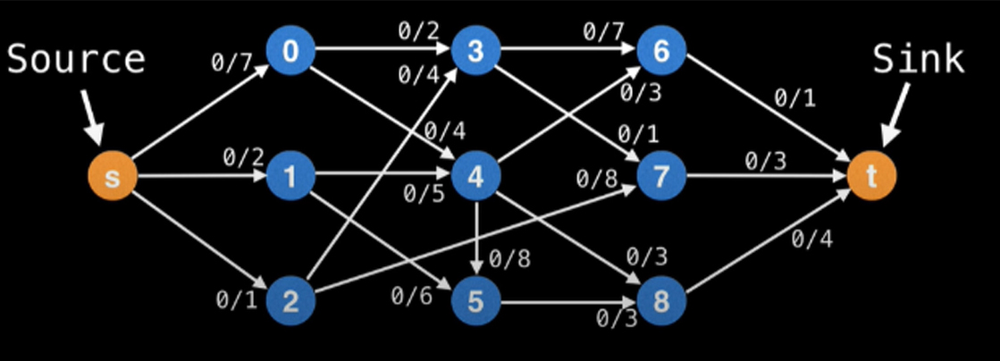
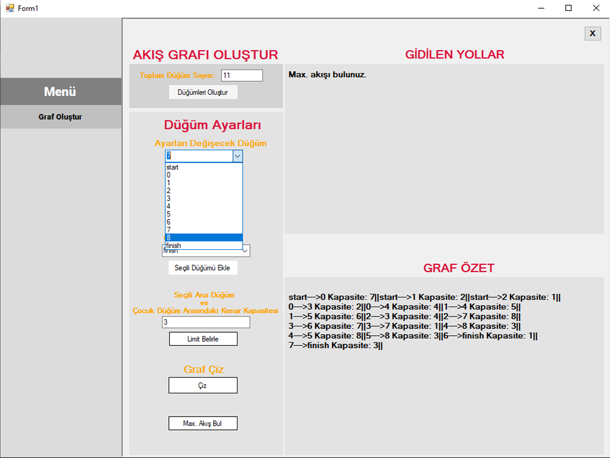
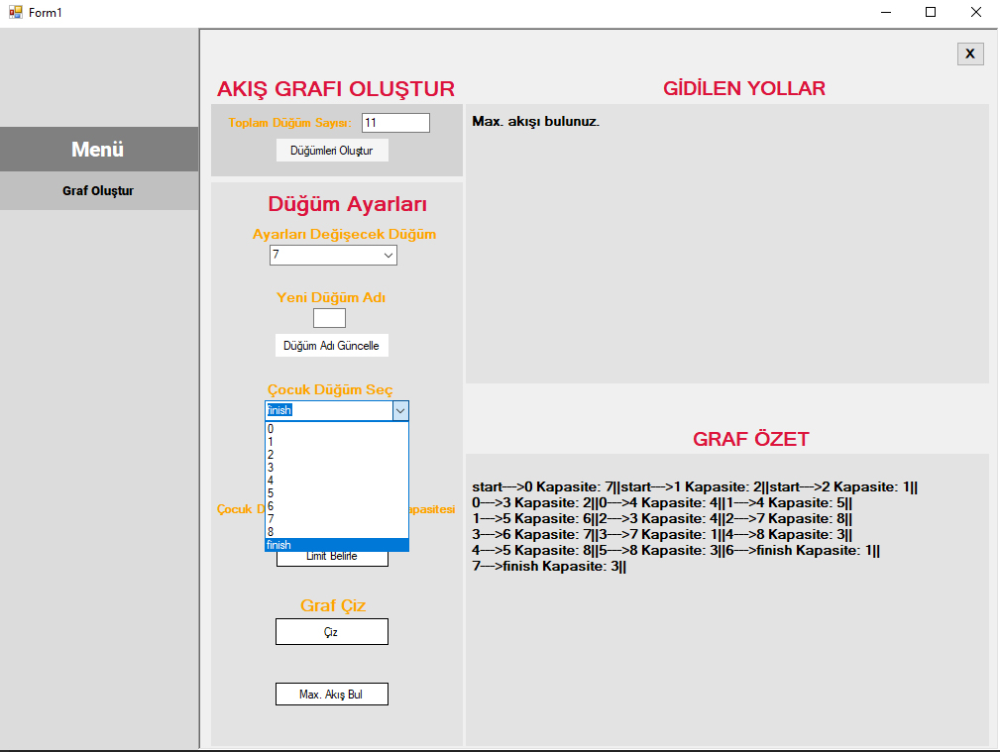
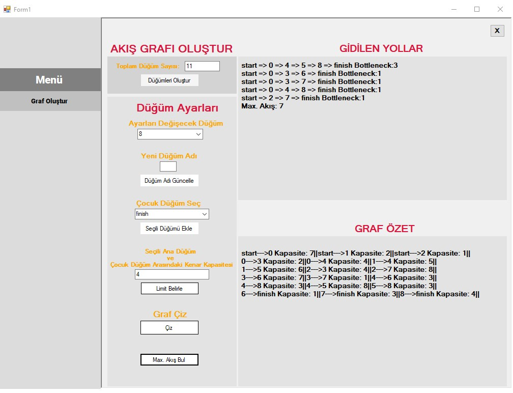
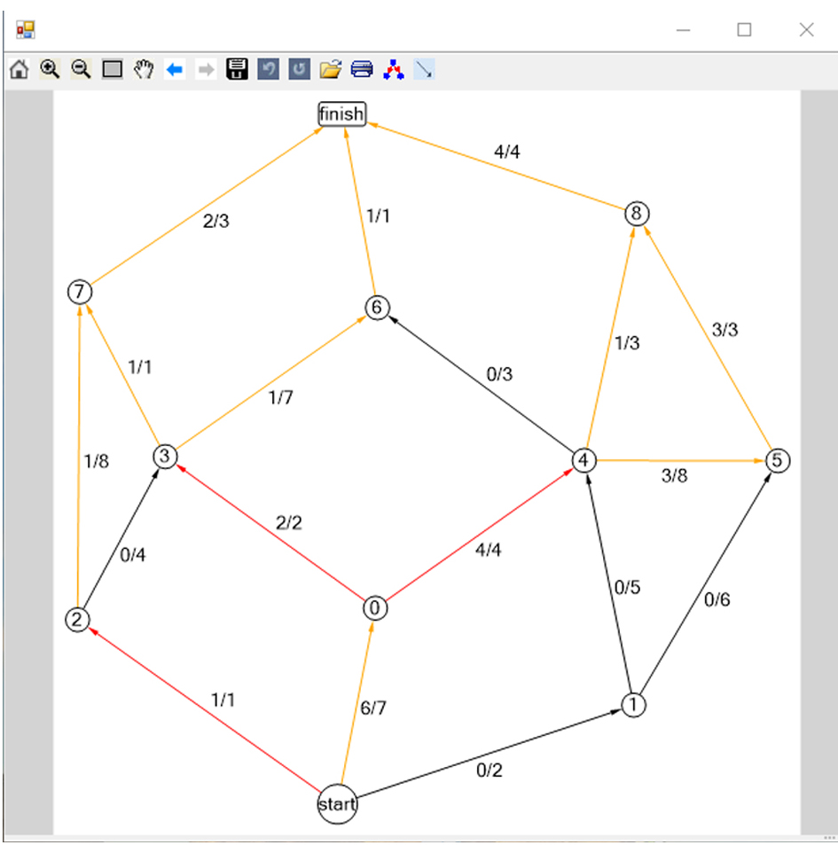

# Maksimum Akış Problemi

## Projenin Amacı
Sınırsız bir kaynaktan sınırsız bir havuza belirtilen tesisat üzerinden en fazla kaç birim akış sağlanabileceğini(Max-Flow) ve en fazla akış durumunda tesisattaki akışı sıfıra indirmek için en az kaç kenarın kesilmesi(Min-Cut) gerektiğini bulmak.

## Kullanılan Algoritmalar
Problemi çözmek için genel olarak kullanılan algoritma Ford-Fulkerson algoritmasıdır. Akış yolu bulmak için ise Capacity Scaling algoritması kullanımıştır.

## Ekran Görüntüleri

###### Örnek Graf

###### Graf Oluşturma Ekranı - 1

###### Graf Oluşturma Ekranı - 2

###### Graf Oluşturma Ekranı - 3

###### Çözüm Grafı

- 
Kırmızı
 renkli kenarlar akışın sıfır olması için kesilmesi gereken kenarları temsil ediyor.
- Turuncu renkli kenarlar akışın sıfırdan farklı olduğu kenarları temsil ediyor.

